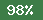

# value-objects
This library provides convenience methods for creating value objects.

You may use the below table to decide which type is best for you.
*"Single Value" means the object will hold a single value, whereas "Array of Values" means the object can hold more than one value.*

|                             | Single Value                                                         | Array of Values                                                       |
|:----------------------------|:---------------------------------------------------------------------|:----------------------------------------------------------------------|
| List of Valid Values        | `IsStringEnumType`<br />`IsIntEnumType`<br/>`IsIntStringMapType`     | `IsStringArrayEnumType`<br />`IsIntArrayEnumType`<br/>`ArrayEnumType` |
| Any Value/Custom Validation | `IsEmailType`<br/>`IsStringType`<br />`IsFloatType` <br/>`IsIntType` | `IsClassCollectionType`<br />`IsCollectionType`                       |

## Quality Control

The following table is updated with each code update and is generated with the help of PhpUnit (unit testing tool) and Infection (mutation testing tool):

| &nbsp;&nbsp;&nbsp;&nbsp;&nbsp;&nbsp;&nbsp;&nbsp;&nbsp;&nbsp;&nbsp;&nbsp;&nbsp;&nbsp;&nbsp;&nbsp;&nbsp;&nbsp;&nbsp;&nbsp;&nbsp;&nbsp;&nbsp;&nbsp;&nbsp;&nbsp;&nbsp;&nbsp;&nbsp;&nbsp;&nbsp;&nbsp;&nbsp;&nbsp;&nbsp;&nbsp;&nbsp;&nbsp;&nbsp;&nbsp;&nbsp;&nbsp; | Percentage               | Description                                                                                                                                                                                                                                                                                                                            |
|:-------------------------------------------------------------------------------------------------------------------------------------------------------------------------------------------------------------------------------------------------------------|:-------------------------|:---------------------------------------------------------------------------------------------------------------------------------------------------------------------------------------------------------------------------------------------------------------------------------------------------------------------------------------|
| Code Coverage                                                                                                                                                                                                                                                |   | How many methods have been fully covered by tests. *Note that the code execution reports are inaccurate and record fewer executed lines of code than were actually executed (and covered)...*                                                                                                                                          |
| Mutation Score Indicator                                                                                                                                                                                                                                     |  | Indicates how many generated mutants were detected. *Note that some mutants are false positives.*                                                                                                                                                                                                                                      |
| Mutation Code Coverage                                                                                                                                                                                                                                       |  | Should be in the same ballpark as the normal code coverage. Formula: `(TotalMutantsCount - NotCoveredByTestsCount) / TotalMutantsCount`                                                                                                                                                                                                |
| Covered Code MSI                                                                                                                                                                                                                                             |  | This is the MSI (Mutation Score Indicator) for code that is actually covered by tests. It shows how effective the tests really are. Formula: `TotalDefeatedMutants / (TotalMutantsCount - NotCoveredByTestsCount)`. *Note that for some reason, Infection reports some mutants not being covered by tests when they actually are.* |


## IsStringEnumType

Use this type when there is a set of fixed valid values, and your object represents a single value.

*If there is a set of fixed valid values but your object represents an array of values, use `IsStringArrayEnumType`.*

Example:
```php
class Season
{
    use IsStringEnumType;

    public const SPRING = 'spring';
    public const SUMMER = 'summer';
    public const AUTUMN = 'autumn';
    public const WINTER = 'winter';

    public static function all() : array
    {
        return [
            self::SPRING,
            self::SUMMER,
            self::AUTUMN,
            self::WINTER,
        ];
    }
}
```

Usage:
```php
$spring = Season::fromString(Season::SPRING);
```

## IsIntEnumType

Use this type when there is a set of fixed valid values, and your object represents a single value.

*If there is a set of fixed valid values but your object represents an array of values, use `IsIntArrayEnumType`.*

Example:
```php
class Status
{
    use IsIntEnumType;
    
    public const INFORMATION  = 1;
    public const SUCCESS      = 2;
    public const REDIRECTION  = 3;
    public const CLIENT_ERROR = 4;
    public const SERVER_ERROR = 5;

    public static function all() : array
    {
        return [
            self::INFORMATION,
            self::SUCCESS,
            self::REDIRECTION,
            self::CLIENT_ERROR,
            self::SERVER_ERROR,
        ];
    }
}
```

Usage:
```php
$success = Status::fromInt(Status::SUCCESS);
```

## IsEmailType

Use this type when the value represents a single e-mail address.
This trait uses `IsStringType` under the hood but performs standard e-mail validation.

Example:

```php
class Email
{
    use IsEmailType;
}
```

Usage:
Usage:
```php
$email = Email::fromString('hello@there.co.uk');
```

## IsStringType

Use this type when the value represents a single string value, but there is no fixed set of valid values.

If you are expecting an e-mail address, you can use the `IsEmailType` trait instead, which will perform format validation checks.


### Validation

To provide custom validation, override `protected function validate(string $value) : void`.

If you want to only validate the length of the string, you can call `validateLength(string $value, ?int $minLength = null, ?int $maxLength = null) : void` inside the `validate` method.


### String transformation

If you want to transform the input value but not fail validation, override `protected function transform(string $value) : string`.

There are 3 convenience methods available that you can call inside `transform` if you want:
- `trimAndLowerCase(string $value)`
- `trimAndUpperCase(string $value)`
- `trimAndCapitalise(string $value)`

Example:

```php
class ProductName
{
    use IsStringType;

    protected function transform(string $value) : string
    {
        return $this->trimAndCapitalise($value);
    }

    protected function validate(string $value) : void
    {
        $this->validateLength($value, 2, 50);
    }
}
```

Usage:
```php
// $productName will be 'Orange juice'
$productName = ProductName::fromString('  orange juice');
```

## IsIntType

Use this type when the value represents a single integer value, but there is no fixed list of valid values, or it is not feasible to write up each valid value.


### Validation

You can provide custom validation rules by overriding `protected function validate(int $value) : void`. By default, it will validate that the value is a positive integer.

If you only want to validate that a value is between a certain minimum and maximum value, override `protected static function minValidValue() : ?int ` and `protected static function maxValidValue() : ?int`. Returning `NULL` from either means there is no limitation to the minimum or the maximum value respectively.

Example:

```php
class Percentage
{
    use IsIntType;

    protected static function minValidValue() : ?int
    {
        return 0;
    }

    protected static function maxValidValue() : ?int
    {
        return 100;
    }
}
```

Another example, for a value without any limitations:
```php
class Balance
{
    use IsIntType;

    protected static function minValidValue() : ?int
    {
        return null;
    }
}
```

Another example, for a value which has no upper limit but may never be below 5.
```php
class Investment
{
    use IsIntType;

    protected static function minValidValue() : ?int
    {
        return 5;
    }
    
    // It is not necessary to add this in as this is the default.
    protected static function maxValidValue() : ?int
    {
        return null;
    }
}
```

Another example which only allows odd values:
```php
class OddIntType
{
    use IsIntType;

    protected function validate(int $value) : void
    {
        if ($value % 2 === 0) {
            throw new InvalidValue(sprintf('Only odd values allowed. Value provided: %d', $value));
        }
    }
}
```

Usage:
```php
$percentage = Percentage::fromInt(78);
```

## IsFloatType

Use this type when the value represents a single float value.


### Validation

You can provide custom validation rules by overriding `protected function validate(float $value) : void`. By default, it will only validate the float is above 0, but you can change this to allow unlimited values by overriding `minValidValue`.

If you only want to validate that a value is between a certain minimum and maximum value, override `protected static function minValidValue() : ?float ` and `protected static function maxValidValue() : ?float`. Returning `NULL` from either means there is no limitation to the minimum or the maximum value respectively.

Example, which allows a value between 0 and 100, and which automatically crops any decimal points after the 3rd:
```php
class Percentage
{
    use IsFloatType;

    protected static function minValidValue() : ?float
    {
        return 0;
    }

    protected static function maxValidValue() : ?float
    {
        return 100;
    }
    
    protected function transform(float $value) : float
    {
        return round($value, 2);
    }
}
```

Usage:
```php
// $percentage will be 78.58
$percentage = Percentage::fromFloat(78.578);
```

## IsIntStringMapType

Use this type if the value represents a single value which can be mapped between an integer and a string.

This may be useful when you e.g. store a value in the database as an integer (for faster indexing), but convert it to a string for a public API (for better readability).

Example:

```php
class Season
{
    use IsIntStringMapType;

    protected static function provideMap() : array
    {
        return [
            1 => 'spring',
            2 => 'summer',
            3 => 'autumn',
            4 => 'winter',
        ];
    }
}
```

Usage:
```php
// Returns 'summer'
$label = (Season::fromInt(2))->toString();

// Returns 4
$intValue = (Season::fromString('winter'))->toInt();
```


## IsIntArrayEnumType

Use this type when the value represents an array of integer values, where each value must be one of a fixed list of values.

Useful when e.g. building filters, allowing to select a number of statuses or IDs (or others) to be included in the result.


### Unique values

If each value can only appear once in the object, you have two options:
- If you want an exception to be thrown when duplicate values are being added (either via `fromArray` or via `withValue`), then override  `protected static function areValuesUnique() : bool` and return `true`. An exception of type `DuplicateValue` will be thrown.
- If you do not want an exception to be thrown but want duplicate values to simply be silently ignored (both in `fromArray` and in `withValue`), override `protected static function ignoreDuplicateValues() : bool` and return `true`. If duplicate values are found, they are only added once to the array.

When both `areValuesUnique` and `ignoreDuplicateValues` return `true`, `ignoreDuplicateValues` takes precedence.

Example:
```php
class Statuses
{
    use IsIntArrayEnumType;
    
    public const INFORMATION  = 1;
    public const SUCCESS      = 2;
    public const REDIRECTION  = 3;
    public const CLIENT_ERROR = 4;
    public const SERVER_ERROR = 5;

    public static function all() : array
    {
        return [
            self::INFORMATION,
            self::SUCCESS,
            self::REDIRECTION,
            self::CLIENT_ERROR,
            self::SERVER_ERROR,
        ];
    }
    
    protected static function areValuesUnique() : bool
    {
        return true;
    }
}
```

Usage:
```php
$statusesToInclude = Statuses::fromArray([Statuses::INFORMATION, Statuses::SUCCESS]);
$allStatuses       = Statuses::withAll();

$statuses = (Statuses::fromArray([]))
    ->withValue(Statuses::SUCCESS)
    ->withValue(Statuses::SERVER_ERROR)
    ->withoutValue(Statuses::SUCCESS);
    
// The difference between tryWithoutValue and withoutValue is that the try method
// will throw an exception if you are trying to remove a value that did not previously
// exist, whereas withoutValue will simply ignore it.
$statusesWithoutSuccess = $statuses->tryWithoutValue(Statuses::SUCCESS);

$containsSuccess = $statusesToInclude->contains(Statuses::SUCCESS);
```


## IsStringArrayEnumType

Use this type when the value represents an array of string values, where each value must be one of a fixed list of values.

Useful when e.g. building filters, allowing to select a number of fields in the result.


### Unique values

If each value can only appear once in the object, you have two options:
- If you want an exception to be thrown when duplicate values are being added (either via `fromArray` or via `withValue`), then override  `protected static function areValuesUnique() : bool` and return `true`. An exception of type `DuplicateValue` will be thrown.
- If you do not want an exception to be thrown but want duplicate values to simply be silently ignored (both in `fromArray` and in `withValue`), override `protected static function ignoreDuplicateValues() : bool` and return `true`. If duplicate values are found, they are only added once to the array.

When both `areValuesUnique` and `ignoreDuplicateValues` return `true`, `ignoreDuplicateValues` takes precedence.

Example:
```php
class UserFieldList
{
    use IsStringArrayEnumType;
    
    public const NAME        = 'name';
    public const EMAIL       = 'email';
    public const STATUS      = 'status';
    public const FRIEND_LIST = 'friendList';

    protected static function all() : array
    {
        return [
            self::NAME,
            self::EMAIL,
            self::STATUS,
            self::FRIEND_LIST,
        ];
    }
}
```

Usage:
```php
$fields = $fieldsFromRequest === null
    ? UserFieldList::withAll()
    : UserFieldList::fromArray($fieldsFromRequest);

$fields    = UserFieldList::fromArray([UserFieldList::NAME, UserFieldList::EMAIL]);
$allFields = UserFieldList::withAll();

$fields = (UserFieldList::fromArray([]))
    ->withValue(UserFieldList::FRIEND_LIST)
    ->withValue(UserFieldList::STATUS)
    ->withoutValue(Statuses::FRIEND_LIST);

$containsFriendList = $statusesToInclude->contains(UserFieldList::FRIEND_LIST);
```


## IsArrayEnumType

Use this type when the value represents an array of values of a type other than `string` and `integer` (for those we have `IsStringArrayEnumType` and `IsIntArrayEnumType` respectively) and where there is a list of valid values.


### Combination with other types
You can combine this type with any other type, e.g. to get an array of float types, or an array of int enum types, etc. The difference to using a combination of `IsStringEnumType` and `IsArrayEnumType` over `IsStringArrayEnumType` is that in the former case, each value is a value object, whereas in the latter, each value is just a scalar string.


### Unique values

If each value can only appear once in the object, you have two options:
- If you want an exception to be thrown when duplicate values are being added (either via `fromArray` or via `withValue`), then override  `protected static function areValuesUnique() : bool` and return `true`. An exception of type `DuplicateValue` will be thrown.
- If you do not want an exception to be thrown but want duplicate values to simply be silently ignored (both in `fromArray` and in `withValue`), override `protected static function ignoreDuplicateValues() : bool` and return `true`. If duplicate values are found, they are only added once to the array.

When both `areValuesUnique` and `ignoreDuplicateValues` return `true`, `ignoreDuplicateValues` takes precedence.


### Validation

You can provide custom validation by overriding `protected function validateEach($value) : void`, which is executed for each value separately, both when instantiating it and when calling `withValue`. Note that this validation will also run before `withoutValue`, `tryWithoutValue` and `contains`, so you are notified when passing something entirely invalid rather than it being silently swallowed.

Example:
```php
/**
 * @method static withValue(Status $addedValue)
 * @method static tryWithoutValue(Status $value)
 * @method static contains(Status $value)
 */
class StatusList
{
    use IsArrayEnumType;

    protected static function all() : array
    {
        return array_map(function($value) {
            return Status::fromInt($value);
        }, Status::all());
    }

    protected function validateEach($value) : void
    {
        if (! is_object($value) || (! $value instanceof Status)) {
            throw InvalidValue::notInstanceOf($value, Status::class);
        }
    }

    protected static function areValuesUnique() : bool
    {
        return true;
    }
    
    protected static function ignoreDuplicateValues() : bool
    {
        return true;
    }
}
```

Usage:
```php
$statuses    = StatusList::fromArray([Status::SUCCESS, Status::REDIRECTION]);
$allStatuses = StatusList::withAll();

// $duplicateStatusesIgnored will only contain Status::SUCCESS once.
// [ Status::SUCCESS, Status::REDIRECTION ]
// This is because of `ignoreDuplicateValues` returning true.
$duplicateStatusesIgnored = StatusList::fromArray([
    Status::SUCCESS, 
    Status::REDIRECTION,
    Status::SUCCESS,
])

// $newStatuses will only contain one instance of Status::REDIRECTION.
// This is because of `ignoreDuplicateValues` returning true.
$newStatuses = $statuses->withValue(Status::REDIRECTION);
```


## IsClassCollectionType

Use this type when the value represents an array of values, where each value must be an instance of a class and there is **no** finite list of valid values.
If there is a list of valid values, use `IsArrayEnumType`.
If the values are not instances of a class, use `IsCollectionType`.


### Unique values

If each value can only appear once in the object, you have two options:
- If you want an exception to be thrown when duplicate values are being added (either via `fromArray` or via `withValue`), then override  `protected static function areValuesUnique() : bool` and return `true`. An exception of type `DuplicateValue` will be thrown.
- If you do not want an exception to be thrown but want duplicate values to simply be silently ignored (both in `fromArray` and in `withValue`), override `protected static function ignoreDuplicateValues() : bool` and return `true`. If duplicate values are found, they are only added once to the array.

When both `areValuesUnique` and `ignoreDuplicateValues` return `true`, `ignoreDuplicateValues` takes precedence.


### Validation

You can provide custom validation by overriding `protected function validateEach($value) : void`, which is executed for each value separately, both when instantiating it and when calling `withValue`. Note that this validation will also run before `withoutValue`, `tryWithoutValue` and `contains`, so you are notified when passing something entirely invalid rather than it being silently swallowed.

Example:

```php
/**
 * @method static withValue(Email $addedValue)
 * @method static tryWithoutValue(Email $value)
 * @method static contains(Email $value)
 */
class EmailCollection
{
    use IsClassCollectionType;
    use CanBeConvertedToStringArray;

    protected function className() : string
    {
        return Email::class;
    }
}
```

Usage:
```php
$emails = EmailCollection::fromArray([
    Email::fromString('hello@there.co.uk'),
    Email::fromString('lorem@ipsum.it'),
    Email::fromString('bass@player.at'),
]);

// Returns ['hello@there.co.uk', 'lorem@ipsum.it', 'bass@player.at']
// This method is provided by the trait `CanBeConvertedToStringArray`
$emailsAsStrings = $emails->toStringArray();

// Returns 3
$numberOfEmails = $emails->count();

// Returns `true`, even though strings are passed. This is because `Email` 
// implements the `__toString` method (via the trait `StringType`).
$emailsMatch = $emails->isEqualTo([
   'hello@there.co.uk',
    'lorem@ipsum.it',
    'bass@player.at',
]);
```

## IsCollectionType

Use this type when the value represents an array of values and there is **no** finite list of valid values. If there is a list of valid values, use `IsArrayEnumType` (or any of the more specific variations, e.g. `IsStringArrayEnumType` if applicable).


### Combination with other types
You can combine this type with any other type, e.g. to get an array of float types, an array of e-mail addresses, etc.
If you need each value to be an instance of a class, consider using `IsClassCollectionType` instead.


### Unique values

If each value can only appear once in the object, you have two options:
- If you want an exception to be thrown when duplicate values are being added (either via `fromArray` or via `withValue`), then override  `protected static function areValuesUnique() : bool` and return `true`. An exception of type `DuplicateValue` will be thrown.
- If you do not want an exception to be thrown but want duplicate values to simply be silently ignored (both in `fromArray` and in `withValue`), override `protected static function ignoreDuplicateValues() : bool` and return `true`. If duplicate values are found, they are only added once to the array.

When both `areValuesUnique` and `ignoreDuplicateValues` return `true`, `ignoreDuplicateValues` takes precedence.


### Validation

You can provide custom validation by overriding `protected function validateEach($value) : void`, which is executed for each value separately, both when instantiating it and when calling `withValue`. Note that this validation will also run before `withoutValue`, `tryWithoutValue` and `contains`, so you are notified when passing something entirely invalid rather than it being silently swallowed.

**It is recommended to set up validation, at least for the value type.**


### Value transformation

If you want to transform the input value but not fail validation, override `protected function transformEach($value)`.

By also using the trait `CanTransformStrings`, you'll get 3 convenience methods that you can call inside `transform` if you want:
- `trimAndLowerCase(string $value)`
- `trimAndUpperCase(string $value)`
- `trimAndCapitalise(string $value)`

Example:

```php
/**
 * @method static withValue(string $addedValue)
 * @method static tryWithoutValue(string $value)
 * @method static contains(string $value)
 */
class ProductNameCollection
{
    use IsCollectionType;
    use CanTransformStrings;

    protected function validateEach($value) : void
    {
        if (! is_string($value)) {
            throw InvalidValue::invalidType($value, 'string');
        }
    }

    /**
    * @param mixed $value
    * @return mixed
     */
    protected function transformEach($value)
    {
        if (! is_string($value)) {
            return $value;
        }
    
        return $this->trimAndCapitalise($value);
    }
}
```

Usage:
```php
// $productNames will be an instance of ProductNameCollection
// with these values: [ 'Orange juice', 'Soap', 'Shampoo' ]
$productNames = ProductNameCollection::fromArray([
    '  orange juice',
    'soap ',
    'SHAMPOO',
]);
```


